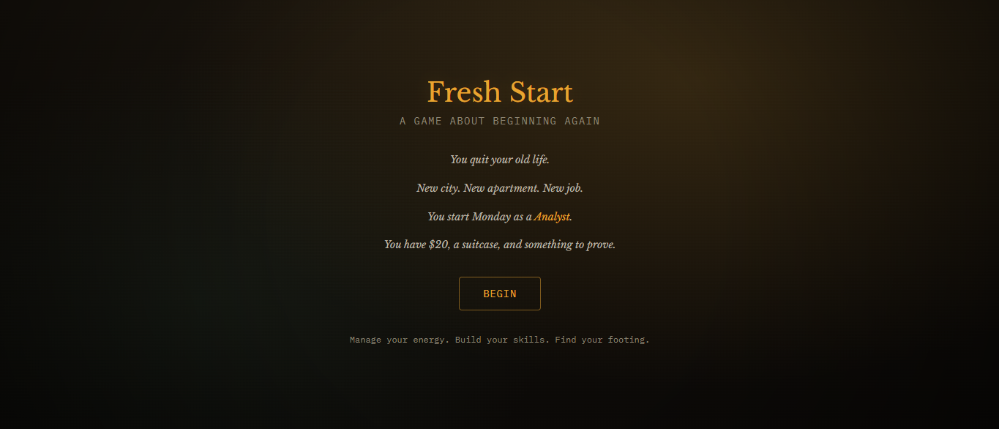

# New Beginnings Adventure

A narrative life-simulation web game built with **React, TypeScript and Tailwind CSS**.



The player progresses through daily actions, managing limited resources (energy, money, happiness and skills) while unlocking milestones and building reputation over time.

---

## Tech Stack

- React
- TypeScript
- Vite
- Tailwind CSS
- shadcn-ui

---

## Features

- Action-based daily progression system
- Limited actions per day
- Resource management (energy, money, happiness, skills)
- Reputation and milestone tracking
- Dynamic event log driven by state changes
- Responsive split-screen layout (sidebar + story + actions)

---

## Architecture

- Component-based structure
- Centralized game state
- Derived UI updates based on player actions
- Modular action system

---

## Planned Improvements

- Save/load system using localStorage
- Visual event feedback (images or animations)
- Improved mobile landscape experience
- Enhanced action tooltips and accessibility
- Expanded milestone system

---

## Development

Clone the repository:

```bash
git clone https://github.com/iaesta/new-beginnings-adventure.git
cd new-beginnings-adventure
npm install
npm run dev